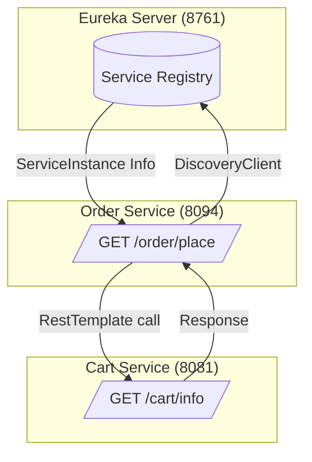
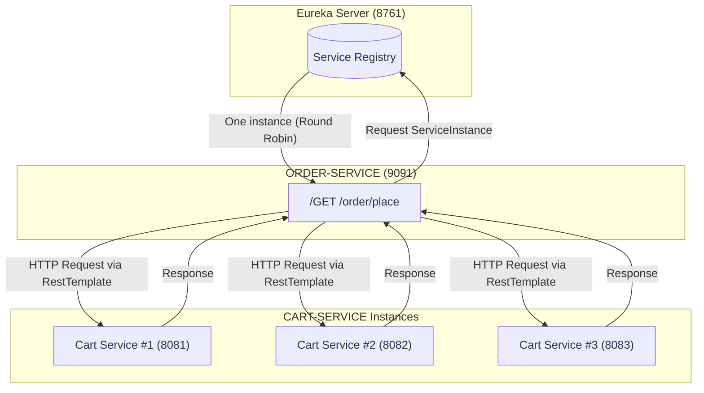

# 🧩 Microservices Communication

---

## 🗣️ What is Microservices Communication?

When one **Microservice (MS)** wants to **send a request and receive a response** from another MS,

that interaction is called **Microservice Communication**.

> All microservices here are Spring Boot REST applications.
>

Traditionally, we could use `RestTemplate` for inter-service calls, **but hardcoding URLs is bad practice** because:

- ✅ MS instances may run on **different systems (dynamic IPs)**
- ✅ Multiple instances may exist for **load balancing**

---

## ☁️ Spring Cloud Communication APIs

Spring Cloud provides several client-side communication mechanisms:

| API | Type | Description |
| --- | --- | --- |
| **1️⃣ DiscoveryClient** | *Legacy* | Fetch instance details from Eureka |
| **2️⃣ LoadBalancerClient** | *Enhanced* | Provides built-in load balancing |
| **3️⃣ OpenFeign Client** | *Modern* | Declarative HTTP client for microservices |

> 🧠 These clients help link two MS apps for communication only.
>

---

# 🛠️ 1) *DiscoveryClient*

## 🧭 DiscoveryClient

**DiscoveryClient** is provided by **Spring Cloud** to get details of a registered MS from **Eureka Server**,

based on the **Service ID** (application name).

```java
List<ServiceInstance> list = discoveryClient.getInstances("SERVICE-ID");

```

Each `ServiceInstance` contains:

```
serviceId + instanceId + URI (HOST + PORT) + other metadata

```

If there’s only one instance of a service:

- The result list has **one element (index 0)**.
- From it, we can get the `URI` and construct the **full URL** by appending the path.
- Use `RestTemplate` to call and get a response.

---

### ❓ Common Q&A

**Q:** Why use `DiscoveryClient`?

**A:** To **fetch MS details from Eureka Server at runtime** (based on `serviceId`).

**Q:** Can `DiscoveryClient` send HTTP requests to another MS?

**A:** ❌ No. It only connects to **Eureka Server**, not to other microservices.

**Q:** Can `Eureka Server` call MS apps?

**A:** ❌ Never. It only stores and provides registration details.

**Q:** What is a `ServiceInstance`?

**A:** Represents one MS instance.

`ServiceInstance = serviceId + instanceId + URI(IP/PORT) + ...`

---

### 🌐 URI vs URL Breakdown

Example:

```
http://192.168.10.11:8086/myapp/employee/find/101

```

| Component | Description |
| --- | --- |
| **Protocol** | http |
| **IP** | 192.168.10.11 |
| **Port** | 8086 |
| **Context Path** | /myapp |
| **Resource Path** | /employee/find/101 |
| **URI** | IP + PORT |
| **URL** | Protocol + URI + ContextPath + ResourcePath |

---

## 🧱 Example Architecture



> 🏗 Flow:
>
>
> OrderService → (uses DiscoveryClient to fetch CART-SERVICE URI from Eureka) →
>
> Calls `/cart/info` using `RestTemplate` → Returns combined response.
>

---

## ⚙️ Implementation Steps

### 1️⃣ Eureka Server

**Project:** `SpringCloudEurekaServer`

**Dependency:** Eureka Server

**Main Class:** `@EnableEurekaServer`

**`application.properties`**

```
spring.application.name=SpringCloudEurekaServer

# RECOMANDED PORT NUMBER
server.port=8761

# DISABLE SELF REGISTER
eureka.client.register-with-eureka=false
eureka.client.fetch-registry=false
```

---

### 2️⃣ Cart Service

**Project:** `SpringCloudCartService`

**Dependencies:** Spring Web, Eureka Discovery Client

**Main:** `@EnableDiscoveryClient`

**`application.properties`**

```
#PORT
server.port=8081

# ServiceId (app Name)
spring.application.name=CART-SERVICE

#Provide eureka location
eureka.client.service-url.defaultZone=http://localhost:8761/eureka

# Register with Eureka (optional by default these are true )
eureka.client.register-with-eureka=true
# Enable Fetching other MS# Details
eureka.client.fetch-registry=true
```

**`CartRestController.java`**

```java
package com.yog.eureka.discoveryclient.springcloudcartservicediscoveryclient.controller;

import org.springframework.http.ResponseEntity;
import org.springframework.web.bind.annotation.GetMapping;
import org.springframework.web.bind.annotation.RequestMapping;
import org.springframework.web.bind.annotation.RestController;

@RestController
@RequestMapping("/cart")
public class CartRestController {

    @GetMapping("/info")
    public ResponseEntity<String> showMessage() {
        return ResponseEntity.ok("WELCOME TO CART SERVICE");
    }
}

```

---

### 3️⃣ Order Service

**Project:** `SpringCloudOrderService`

**Main:** `@EnableDiscoveryClient`

**`application.properties`**

```
#PORT
server.port=8094

# ServiceId (app Name)
spring.application.name=ORDER-SERVICE

#Provide eureka location
eureka.client.service-url.defaultZone=http://localhost:8761/eureka

```

**`CartConsumer.java`**

```java
package com.yog.eureka.discoveryclient.springcloudorderservicediscoveryclient.consumer;

import org.springframework.beans.factory.annotation.Autowired;
import org.springframework.cloud.client.ServiceInstance;
import org.springframework.cloud.client.discovery.DiscoveryClient;
import org.springframework.http.ResponseEntity;
import org.springframework.stereotype.Component;
import org.springframework.web.client.RestTemplate;

import java.net.URI;
import java.util.List;

@Component
public class CartConsumerUsingDiscoveryClient {

    //Impl class is : EurekaDiscoveryClient -- given by Netflix Eureka
    @Autowired
    private DiscoveryClient client;

    public String getCartResponse() {
        // Goto Eureka server with serviceId
        List<ServiceInstance> list = client.getInstances("CART-SERVICE");

        // read at index#0 ==> returns SI
        ServiceInstance si = list.get(0);

        // read URI
        URI uri = si.getUri();

        // add path ==> return URL
        String url = uri + "/cart/info";

        // use RestTemplate and call
        RestTemplate rt = new RestTemplate();

        //make HTTP Request and get response
        ResponseEntity<String> response = rt.getForEntity(url, String.class);

        //return response body
        return response.getBody();
    }
}

```

**`OrderRestController.java`**

```java
package com.yog.eureka.discoveryclient.springcloudorderservicediscoveryclient.controller;

import com.yog.eureka.discoveryclient.springcloudorderservicediscoveryclient.consumer.CartConsumerUsingDiscoveryClient;
import org.springframework.beans.factory.annotation.Autowired;
import org.springframework.http.ResponseEntity;
import org.springframework.web.bind.annotation.GetMapping;
import org.springframework.web.bind.annotation.RequestMapping;
import org.springframework.web.bind.annotation.RestController;

@RestController
@RequestMapping("/order")
public class OrderRestController {

    @Autowired
    private CartConsumerUsingDiscoveryClient consumer;

    @GetMapping("/place")
    public ResponseEntity<String> placeOrder() {
        String cartResp = consumer.getCartResponse();
        return ResponseEntity.ok("ORDER PLACED WITH => " + cartResp);
    }

}
```

---

## ▶️ Execution Flow

1. Run **Eureka Server**
2. Run **Cart Service**
3. Run **Order Service**
4. Open **Eureka Dashboard:**

   🔗 `http://localhost:8761`

5. Verify that both services are registered.
6. Call from browser/postman:

   🔗 `http://localhost:8094/order/place`


**✅ Output:**

```
ORDER PLACED WITH => WELCOME TO CART SERVICE

```

---

## 🧠 Summary

| Concept | Description |
| --- | --- |
| **DiscoveryClient** | Fetches service details from Eureka |
| **Eureka Server** | Service registry for microservices |
| **RestTemplate** | Makes actual HTTP calls |
| **ServiceInstance** | Represents one running MS instance |
| **Order → Cart flow** | DiscoveryClient + RestTemplate based call |

---


# 🛠️ 2) **LoadBalancerClient**

---

# ⚙️ Microservices Communication — *LoadBalancerClient*

---

## 🧩 Why Load Balancing Matters

When a microservice application runs **multiple instances** (on different servers or ports), it’s to:

- ⚡ **Improve performance**
- ⚖️ **Distribute load evenly** among instances
- 🧠 **Increase availability** and fault tolerance

However, when using **DiscoveryClient**, it only gives back a **List of all ServiceInstances**, and you have to choose one manually.

That’s where `LoadBalancerClient` helps.

---

## 🧠 What is LoadBalancerClient?

**LoadBalancerClient** is a **Spring Cloud** interface that automatically chooses **one instance** of a service with the least load factor.

> Internally, it follows a Round Robin or similar load-balancing algorithm.
>

---

### 🚀 Key Points

1️⃣ If you run the same MS multiple times → multiple **instances** are created.

2️⃣ `DiscoveryClient` returns all instances — but **does not** help in choosing one.

3️⃣ `LoadBalancerClient` picks **one instance** automatically.

4️⃣ Used for **Client-Side Load Balancing**.

5️⃣ When using multiple instances, configure a unique instance ID:

```
eureka.instance.instance-id=${spring.application.name}:${random.value}

```

---

## 📦 Components Overview

| Component | Role | Port | Notes |
| --- | --- | --- | --- |
| **Eureka Server** | Service Registry | `8761` | Stores service metadata |
| **Cart Service** | Producer | `8081`, `8082`, `8083` | Registered multiple times |
| **Order Service** | Consumer | `9091` | Uses LoadBalancerClient |

---

## ☁️ How LoadBalancerClient Works



> ⚖️ Each request from Order Service may go to a different Cart Service instance, depending on the round-robin selection.
>

---

## 🏗️ Implementation Steps

### 1️⃣ Eureka Server

**Project:** `SpringCloudEurekaServer`

**Dependency:** Eureka Server

**Main:** `@EnableEurekaServer`

**`application.properties`**

```
spring.application.name=SpringCloudEurekaServer

# RECOMANDED PORT NUMBER
server.port=8761

# DISABLE SELF REGISTER
eureka.client.register-with-eureka=false
eureka.client.fetch-registry=false
```

---

### 2️⃣ Cart Service (Producer)

**Project:** `SpringCloudCartService`

**Dependencies:** Spring Web, Eureka Discovery Client

**Main:** `@EnableDiscoveryClient`

**`application.properties`**

```
# Example for 3 different instances
server.port=8081  # change to 8082, 8083 for other runs

spring.application.name=CART-SERVICE
eureka.client.service-url.defaultZone=http://localhost:8761/eureka

# Unique instance ID
eureka.instance.instance-id=${spring.application.name}:${random.value}

```

**`CartRestController.java`**

```java
package com.yog.eureka.loadbalclient.springcloudcartserviceloadbalclient.controller;

import org.springframework.beans.factory.annotation.Value;
import org.springframework.http.ResponseEntity;
import org.springframework.web.bind.annotation.GetMapping;
import org.springframework.web.bind.annotation.RequestMapping;
import org.springframework.web.bind.annotation.RestController;

@RestController
@RequestMapping("/cart")
public class CartRestController {

    @Value("${server.port}")
    private String port;

    @GetMapping("/info")
    public ResponseEntity<String> showMessage() {
        return ResponseEntity.ok("WELCOME TO CART SERVICE =>" + port);
    }
}
```

---

### 3️⃣ Order Service (Consumer)

**Project:** `SpringCloudOrderService`

**Dependencies:** Spring Web, Eureka Discovery Client, Spring Cloud LoadBalancer

**Main:** `@EnableDiscoveryClient`

**`application.properties`**

```
server.port=9091
spring.application.name=ORDER-SERVICE
eureka.client.service-url.defaultZone=http://localhost:8761/eureka

```

**`CartConsumer.java`**

```java
package com.yog.eureka.loadbalclient.springcloudorderserviceloadbalclient.consumer;

import org.springframework.beans.factory.annotation.Autowired;
import org.springframework.cloud.client.ServiceInstance;
import org.springframework.cloud.client.loadbalancer.LoadBalancerClient;
import org.springframework.http.ResponseEntity;
import org.springframework.stereotype.Component;
import org.springframework.web.client.RestTemplate;

@Component
public class CartConsumer {

    @Autowired
    private LoadBalancerClient loadBalancerClient;

    public String getCartResponse() {
        ServiceInstance choose = loadBalancerClient.choose("CART-SERVICE");
        String url = choose.getUri() + "/cart/info";
        System.out.println("*********************** " + url + " **********************");

        RestTemplate rt = new RestTemplate();
        ResponseEntity<String> response = rt.getForEntity(url, String.class);
        return response.getBody();
    }
}

```

**`OrderRestController.java`**

```java
package com.yog.eureka.loadbalclient.springcloudorderserviceloadbalclient;

import com.yog.eureka.loadbalclient.springcloudorderserviceloadbalclient.consumer.CartConsumer;
import org.springframework.beans.factory.annotation.Autowired;
import org.springframework.http.ResponseEntity;
import org.springframework.web.bind.annotation.GetMapping;
import org.springframework.web.bind.annotation.RequestMapping;
import org.springframework.web.bind.annotation.RestController;

@RestController
@RequestMapping("/order")
public class OrderRestController {

    @Autowired
    private CartConsumer consumer;

    @GetMapping("/place")
    public ResponseEntity<String> placeOrder() {
        String cartResp = consumer.getCartResponse();
        return ResponseEntity.ok("ORDER PLACED WITH => " + cartResp);
    }

}

```

---

## ▶️ Execution Order

1️⃣ Start **Eureka Server**

2️⃣ Run **Cart Service** three times on different ports (`8081`, `8082`, `8083`)


3️⃣ Start **Order Service**

4️⃣ Open **Eureka Dashboard:**

🔗 `http://localhost:8761`

5️⃣ Confirm all services are registered.

6️⃣ Hit endpoint:

🔗 `http://localhost:9091/order/place`

Each time you refresh, you’ll see responses like:

```
ORDER PLACED WITH => WELCOME TO CART SERVICE =>8081
ORDER PLACED WITH => WELCOME TO CART SERVICE =>8082
ORDER PLACED WITH => WELCOME TO CART SERVICE =>8083

```

> 💡 Notice the changing port → means LoadBalancerClient is distributing requests across instances.
>

---

## 💬 Q&A Summary

| Question | Answer |
| --- | --- |
| **Why use LoadBalancerClient?** | To work with multiple instances of the same service. Performs **Client-Side Load Balancing**. |
| **Old Load Balancer Vendor?** | 🎯 Ribbon (now deprecated). |
| **Current Load Balancer?** | 🆕 Spring Cloud LoadBalancer. |
| **How many instances are returned per request?** | Only **one** (based on algorithm). |
| **Is RestTemplate still required?** | ✅ Yes — LoadBalancerClient only picks the instance; HTTP calls still use RestTemplate. |

---

## 🧠 Summary

| Concept | Description |
| --- | --- |
| **DiscoveryClient** | Lists all service instances from Eureka |
| **LoadBalancerClient** | Picks one instance automatically |
| **Eureka Server** | Central registry |
| **RestTemplate** | Makes HTTP call |
| **Cart Service** | Producer service |
| **Order Service** | Consumer service |
| **Algorithm Used** | Round Robin (default) |

---